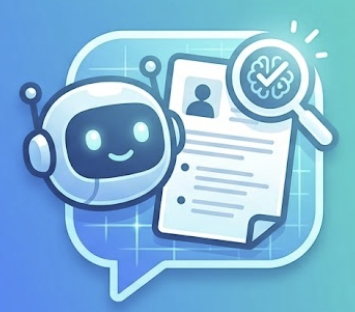
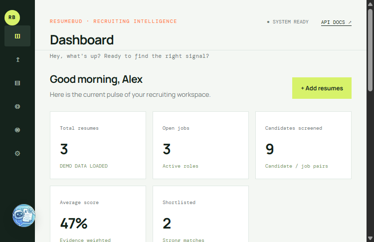
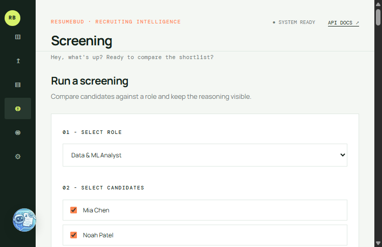
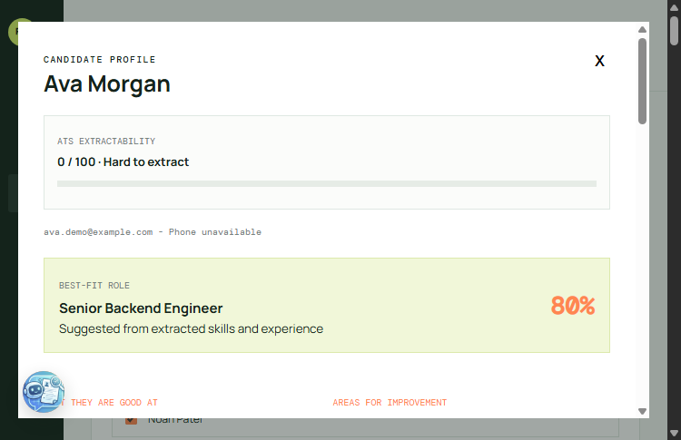
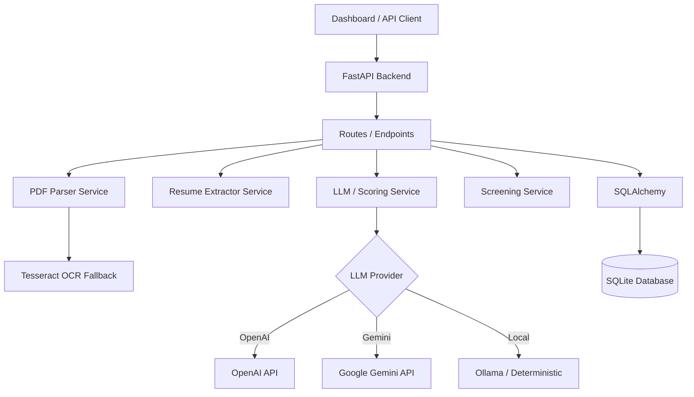

<div align="center">
  
  <h1 align="center">Smart Resume Screener (ResumeBUD)</h1>

  <p align="center">
    An intelligent, explainable resume screening service for parsing resumes, extracting skills, and matching candidates with job descriptions.<br>
    Powered by <strong>Gemini 3.5 Flash Lite</strong> and an <strong>Offline Local Scorer</strong>.
    <br />
    <a href="#features"><strong>Explore the docs »</strong></a>
    <br />
    <br />
    <a href="#demo-video">View Demo</a>
    ·
    <a href="#api-endpoints">API Reference</a>
    ·
    <a href="#screenshots">Screenshots</a>
  </p>
</div>

<!-- Badges -->
<div align="center">
  
  
  
  
  
</div>

<hr />

## 🎥 Demo Video

<div align="center">
  <a href="https://www.loom.com/share/59fa7a8810b94db7bff5bdeeac580c64?t=3" target="_blank">
    
  </a>
</div>


## ✨ Features

- 📄 **Intelligent Resume Parsing:** Extract structured data (Name, Email, Phone, Skills, Experience, Education) using `PyMuPDF`.
- 🔍 **OCR Fallback:** Support for scanned/image-only PDFs via Tesseract.
- 🎯 **Semantic Matching & Scoring:** Compare resumes with job descriptions using LLMs (OpenAI, Gemini, Ollama) and output an explainable 1-10 match score with justification.
- 📊 **ATS Extractability Score:** Get feedback from 0-100 on how machine-readable a resume is.
- 💻 **Dashboard Interface:** Lightweight frontend for uploading resumes, creating jobs, and screening.
- 🔐 **Privacy-First Local Mode:** Includes a deterministic local scorer for use without API keys.

## 📸 Screenshots

| Dashboard Overview | Screening Rankings | Detailed Candidate Profile |
| :---: | :---: | :---: |
|  |  |  |

*(Replace the placeholder images with screenshots of your running app)*

## 🛠️ Tech Stack & Tools Used

| Category | Technology |
|---|---|
| **Backend** |   |
| **Database** |   |
| **Frontend** |    |
| **AI & LLM** |   |
| **PDF Processing**| `PyMuPDF`, `pytesseract` (OCR) |

## 🏗️ Architecture



## 🚀 Getting Started

### Prerequisites
- Python 3.11+
- Tesseract OCR (Optional, for scanned PDFs)

### 1. Clone & Install (or use `setup_and_run.bat`)

**Easiest Setup (Windows):**
Simply double-click the `setup_and_run.bat` file! It will automatically create a virtual environment, install dependencies, and start the server.

**Manual Setup (Windows PowerShell):**
```powershell
python -m venv .venv
.venv\Scripts\Activate.ps1
pip install -r requirements.txt
Copy-Item .env.example .env
```

**Linux/macOS:**
```bash
python3 -m venv .venv
source .venv/bin/activate
pip install -r requirements.txt
cp .env.example .env
```

### 2. Configure Environment

Edit the `.env` file to set your preferred LLM provider. The project comes with a **Local Deterministic Scorer** by default, but you can configure an LLM:

**OpenAI (Recommended):**
```env
LLM_PROVIDER=openai
LLM_API_KEY=sk-your-openai-key
LLM_MODEL=gpt-4o-mini
```

**Google Gemini (Free Tier):**
```env
LLM_PROVIDER=gemini
GEMINI_API_KEY=your_gemini_key
GEMINI_MODEL=gemini-3.5-flash-lite
```

**Ollama (Local):**
```env
LLM_PROVIDER=ollama
OLLAMA_MODEL=llama3.2
```

### 3. Run the Server
```bash
python run.py
```
Visit [http://127.0.0.1:8000](http://127.0.0.1:8000) for the dashboard, or [http://127.0.0.1:8000/docs](http://127.0.0.1:8000/docs) for the interactive Swagger API documentation.

## 🌟 Additional Features (Beyond Assignment Scope)

While meeting all core requirements, this project goes above and beyond with several production-ready features:
- **Offline Mode**: A built-in deterministic scorer allows the app to run completely offline without any API keys.
- **Frontend Dashboard**: A beautiful, vanilla JS single-page application for uploading resumes and managing screening.
- **OCR Fallback**: Automatically extracts text from scanned, image-only PDFs using Tesseract OCR.
- **ATS Extractability Score**: Evaluates resumes on how machine-readable they are (0-100 score).
- **One-Click Demo Workspace**: Quickly seed the database with mock roles and candidates to evaluate the app immediately.
- **Explainable UI**: Detailed candidate profiles showing exactly why a score was given (strengths, gaps, and recommendations).

## 🔌 API Endpoints

- `POST /resumes/upload`: Upload a PDF/TXT resume to extract and store candidate data.
- `GET /resumes`: List all parsed candidates.
- `GET /resumes/{candidate_id}`: Retrieve a specific candidate's structured profile.
- `POST /jobs`: Create a new job listing with required skills.
- `POST /screen`: Screen candidates against a job description.
- `GET /screen/results/{job_id}`: Retrieve ranked screening results.

## 🧠 LLM Usage Guidance

**Prompts Design (`app/prompts/screening_prompt.py`):**
- Ensures evidence-only evaluation without inventing qualifications.
- Differentiates between 'nice-to-have' and 'required' skills.
- Demands machine-readable JSON output for explainability.
- Example LLM instruction: *"Compare the following resume with this job description and rate fit on 1–10 with justification, listing matching skills, gaps, and strengths."*

## 🛡️ Best Practices & Security

- **Secrets Management:** The repository includes a strict `.gitignore` to prevent committing `.env` files, API keys, or uploaded applicant resumes.
- **Data Privacy:** Local mode ensures no applicant data leaves your machine. Be mindful of terms when using cloud APIs.
